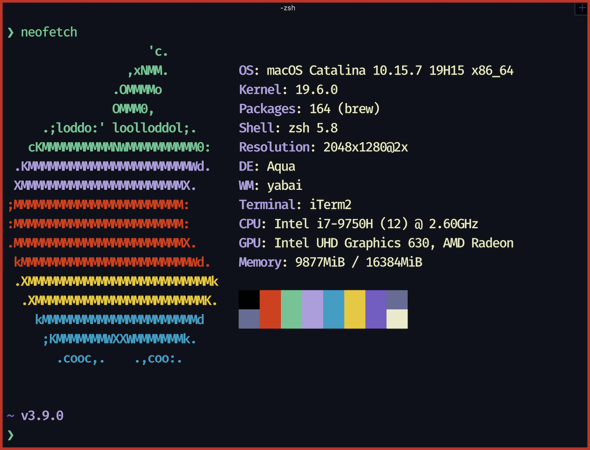

Hello! I'm Richban. 👋

I'm a ["software engineer"](https://www.youtube.com/watch?v=N2bXEUSAiTI&t=4554shttps://www.youtube.com/watch?v=N2bXEUSAiTI&t=4554s) specialized in DE and ML engineering.
Most of the time I translate business requirements into code.
If you’re interested in what I’m working on, have a question, or just want to talk, hit that follow button on [Twitter](https://twitter.com/richban_) and/or send me a DM.

### Background

I worked for statups and Fortune 500 Companies.
Through developing various PaaS products and getting involved in building
startups over the years, I then decided to pivot my career into the
tech+business sector working as a Consultant.

### Current Role

I'm currently a consultant at a big four firm - helping clients to become
data-driven organizations. I work closely with data scientist, machine learning
experts and data engineers.

### What I Do

💻 <a style={{color: `#39BAE6`, fontWeight: `bold`, textDecoration: `none`}}>Data
Engineering:</a> I develop ETL pipelines, automated data-processing systems,
automation tools which help to make data driven-decisions.

🧠 <a style={{color:`#FFB454`, fontWeight: `bold`, textDecoration: `none`}}>ML Engineering:</a>
I help machine learning experts and data science teams to design, build,
and productionize ML models to solve business challenges.

☁️ <a style={{color: `#C2D94C`, fontWeight: `bold`, textDecoration: `none`}}>Cloud Engineering:</a>
I build, maintain and design scalable cloud-native applications using Google and MS Azure best practices and tools.

🔎 <a style={{color: `#FFEE99`, fontWeight: `bold`, textDecoration: `none`}}>Consulting:</a>
I help clients to innovate and transform their business, so that they can become a truly data-driven organizations.

### System

