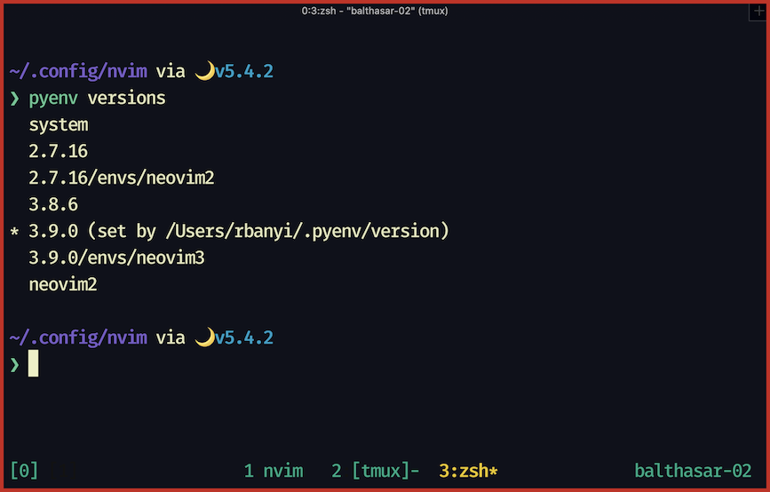
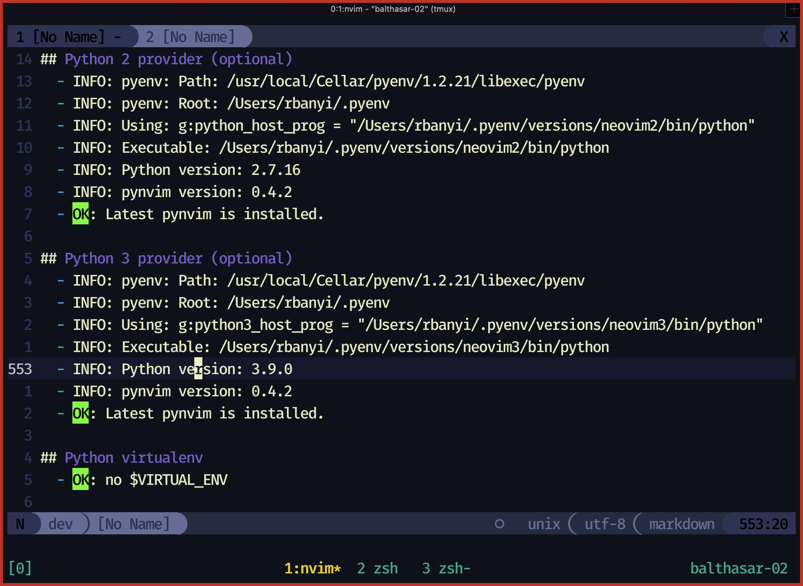
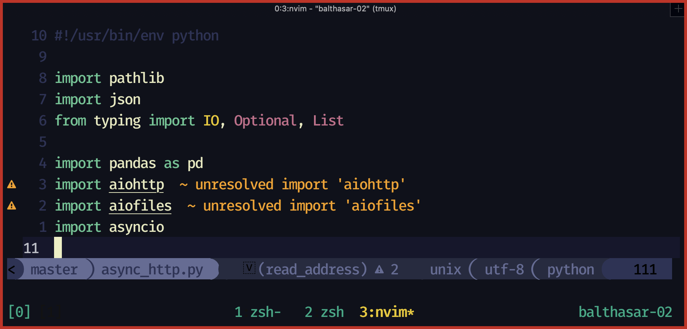

### Introduction

The objective of this post is to demonstrate my python development
environment and describe the various tools I use to manage Python
versions/packages.

I will not go into detail and behind scenes to understand each tool but I will
try to instead summarize in 1 or 2 sentences the problem and the solution for
each puzzle.

### Installing Python with Homebrew

Installing Python using Homebrew `brew install python3` means you will have
only a single version of python and you have no control over what that version is.

Homebrew installs all packages into its own directory at [/usr/local/Cellar]().
To see the current (active) version installed run the following command:

`brew --cellar python`

> In some cases you might find multiple versions installed under
> [/usr/local/Cellar/python@3.8]() and [/usr/local/Cellar/python@3.9]() that's
> because Homebrew updated the Python version. However, the **python3** command
> will be overwritten each time.

Since I am on OS X _Homebrew_ is my default package manager and many other packages
have Python3 as a dependency I have an installation of Python via _Homebrew_ on
my system as well.

For example, installing python bindings for **QT** `brew install pyqt` will install **python@3.9** as its dependency.

### pyenv

Allows you to install many different versions of Python on the same system.
To install [pyenv](https://github.com/pyenv/pyenv) follow the official
installation guideline.

> Note you can easily install **pyenv** with **Homebrew** - **pyenv** does not depend on Python itself.

```bash
brew install pyenv
brew install pyenv-virtualenv

echo 'export PYENV_ROOT="$HOME/.pyenv"' >> ~/.zshrc
echo 'export PATH="$PYENV_ROOT/bin:$PATH"' >> ~.zshrc
echo -e 'if command -v pyenv 1>/dev/null 2>&1; then\n  eval "$(pyenv init -)"\nfi' >> ~/.zshrc
exec $SHELL
```



### Python for Neovim

Neovim requires a package to be installed for Python plugins to work.
Since I'm using **virtualenv** for all of my work, and I like to keep my environments
organized and clean, I have a dedicated environment for **Neovim**, and only **Neovim**. This ensures
that I don't need to install the **pynvim** package to each virtual environment.

```bash
pyenv install 2.8.6
pyenv install 3.9.0

pyenv virtualenv 2.8.6 neovim2
pyenv virtualenv 3.9.0 neovim3

pyenv activate neovim2
pip install neovim
pyenv which python  # note the path

pyenv activate neovim3
pip install neovim
pyenv which python  # note the path
```

Note the interpreters paths and add them to your [init.lua](https://github.com/richban/.dotfiles/blob/master/dotfiles/config/nvim/init.lua) config file:

```
vim.g.python_host_prog = '/full/path/to/neovim2/bin/python'
vim.g.python3_host_prog = '/full/path/to/neovim3/bin/python'
```

Lastly, within my **neovim3** virtual environment, I install a bunch of other python
packages that are required by Neovim plugins:

```bash
pip install 'python_language_server[all]' pyls-black flake8 pep8-naming jupyter_qtconsole_colorschemes
```

To check that the python environment is set up correctly run the **Ex** command `:checkhealth` inside **Neovim**:



### pipenv

Pipenv is a dependency manager for Python projects. It is my main driver for every python project which allows me to keep packages of different Python projects isolated from one another as well as specifying the required Python version for each project.

```bash
# Preferred installation method via `pipx`
pip install --user pipx
pipx install pipenv
# create a project directory
mkdir ~/py-project && cd py-project
# init a python project using Python 3.9, specifically:
pipenv --python 3.9
```

Under the hood **pipenv** utilizes tools such as:

1. **virtualenv** - makes sure that packages are isolated
2. **pip** - fetches and installes packages
3. **pyenv** - installs the specified python version

### Avoiding reinstalling Jupyter for all virtualenvs

In many of my projects, I work with Jupyter notebooks. It becomes really annoying when I need to install `pipenv install jupyter` and all its dependencies to each virtual environment.
The solution for this problem is fairly easy, based on [Max Horn blog post](https://expectationmax.github.io/2018/Neovim-pipenv-based-development-environment/):

> The trick is, that we only need to install the JuPyter kernel in the individual virtual environments, and register these kernels in the global installation.

I modified a bit his script (added an argument for specifying the python version) which allows initializing a python environment with **ipykernel** via **pipenv**.

```bash
init_pipenv () {
echo -e "Setting up* pipenv environment"
    pipenv --python $1
    echo -e "Installing ipython kernel"
    pipenv install --dev ipykernel
    # get name of environment and remove checksum for pretty name
    venv_name=$(basename -- $(pipenv --venv))
    venv_prettyname=$(echo $venv_name | cut -d '-' -f 1)
    echo -e "Adding ipython kernel to list of jupyter kernels"
    $(pipenv --py) -m ipykernel install --name $venv_name \
    --display-name "Python3 ($venv_prettyname)"
}
```

> Note: I have JuPyter installed in the global Python 3.9.0 environment

Typical workflow including **Jupyter** and **ipykernel** via **pipenv**:

```bash
# create project directory
mkdir ~/py-project & cd py-project
# init python environment with Python 3.8.6
init_pipenv 3.8.6
# run ipykernel
pipenv run python -m ipykernel
# open a new pane or terminal
jupyter notebook
```

### pipenv + neovim + tmux



In order for [LSP]() to resolve your imports and indicate Neovim that you're inside a **virtualenv**,
you have to spawn **Neovim** within the **virtualenv**: `pipenv run neovim` or spawn a subshell in the **virtualenv**
and run **Neovim** inside:

```bash
# spawn subshell in virtualenv
pipenv shell
# run neovim
neovim
```

However, if you're using [tmux]() and [vim-tmux-navigator](https://github.com/christoomey/vim-tmux-navigator)
in your workflow there is a known [issue](https://github.com/christoomey/vim-tmux-navigator/issues/195) when you
try to navigate between your **Neovim** and **tmux** panes.
